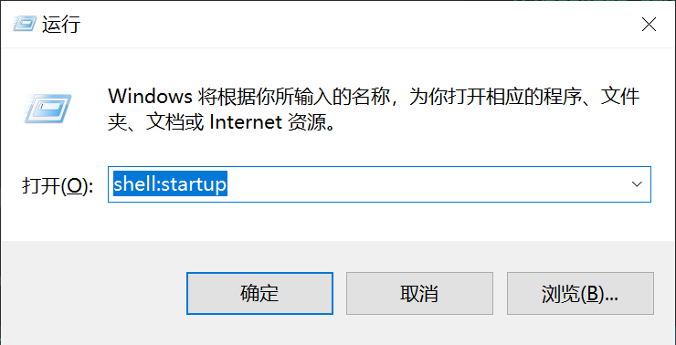
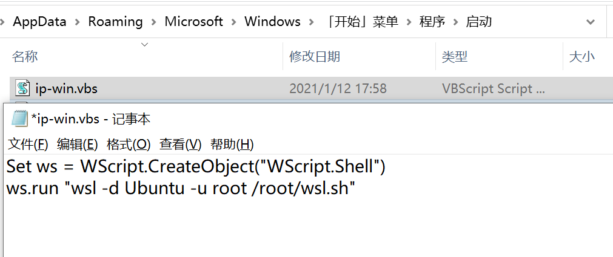
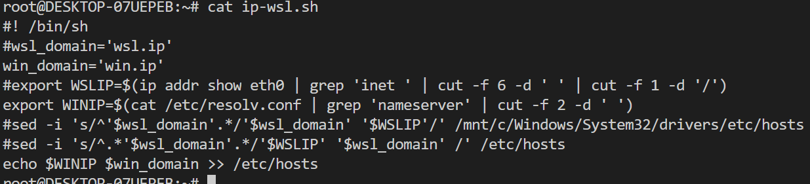

## 在 Wsl2 中访问，通过域名访问 Win
1. 在 win 中，运行 **shell:startup**，创建文件 **ip-win.vbs**

2. 在 wsl 中，创建 **/root/ip-wsl.sh** 文件

***
* 至此，每次启动 win 会自动修改 wsl 中的/etc/hosts文件
* 在wsl中可以通过域名 **win.ip** 访问 win 主机了😊
